```{r, echo=FALSE}
library(metathis)
meta() %>% 
  meta_description(params$event) %>% 
  meta_name("github-repo" = paste0("datactivist/", params$slug)) %>% 
  meta_viewport() %>% 
  meta_social(
    title = params$title,
    url = paste0("https://datactivist.coop/", params$slug),
    image = params$image,
    image_alt = params$image_alt,
    og_type = "website",
    og_author = "Datactivist",
    og_locale = "fr_FR",
    og_site_name = "Datactivist",
    twitter_card_type = "summary",
    twitter_creator = "@datactivi_st")

```

layout: true


<style>
.remark-slide-number {
  position: inherit;
}

.remark-slide-number .progress-bar-container {
  position: absolute;
  bottom: 0;
  height: 4px;
  display: block;
  left: 0;
  right: 0;
}

.remark-slide-number .progress-bar {
  height: 100%;
  background-color: #e95459;
}

</style>

`r paste0("<div class='my-footer'><span>", params$event, "</span> <center><div class=logo><a href='https://datactivist.coop/'></a></div></center></span></div>")`


---
class: center, middle

Ces slides en ligne : `r paste0("http://datactivist.coop/", params$slug)`

Sources : `r paste0("https://github.com/datactivist/", params$slug)`

Les productions de Datactivist sont librement réutilisables selon les termes de la licence [Creative Commons 4.0 BY-SA](https://creativecommons.org/licenses/by-sa/4.0/legalcode.fr).

<BR> <BR>


---
### Quelques mots sur Datactivist

- Datactivist est un société coopérative .red[**pure player de l’open data**] créé en 2016, par Samuel Goëta et Joël Gombin.

- Se positionnant sur .red[**toutes les étapes du travail d’ouverture des données**], Datactivist travaille tant avec les producteurs de données qu’avec les réutilisateurs et participe à l’appropriation des données par chacun.

- Nous appliquons nos propres .red[**valeurs**] : nous sommes une coopérative ; nos supports de formation et nos contenus sont librement réutilisables, publiés en licence Creative Commons.

- Une approche issue de la recherche : voir notamment **https://datactivist.coop/these**. 

- Nous animons la communauté [#TeamOpenData](https://teamopendata.org).

---
### Quelques mots sur Datactivist

Nos métiers : 

- Conseil sur les .red[**stratégies d’ouverture de données**] : nous aidons les organisations dans la conception et la mise en œuvre de leur stratégie d’ouverture de données.

- .red[**Accompagnement dans la réutilisation de données ouvertes**] : nous aidons les organisations à utiliser les données au quotidien. 

- .red[**Sensibilisation et formation à la donnée**] : nous formons à la culture générale des données, nous enseignons les grands principes et bonnes pratiques de l'open data et nous introduisons à la data science. 

- .red[**Médiation de données**] : nous organisons des hackathons, des open data camps, des expéditions de données...

---
### Datactivist : une entreprise née de la recherche

.center[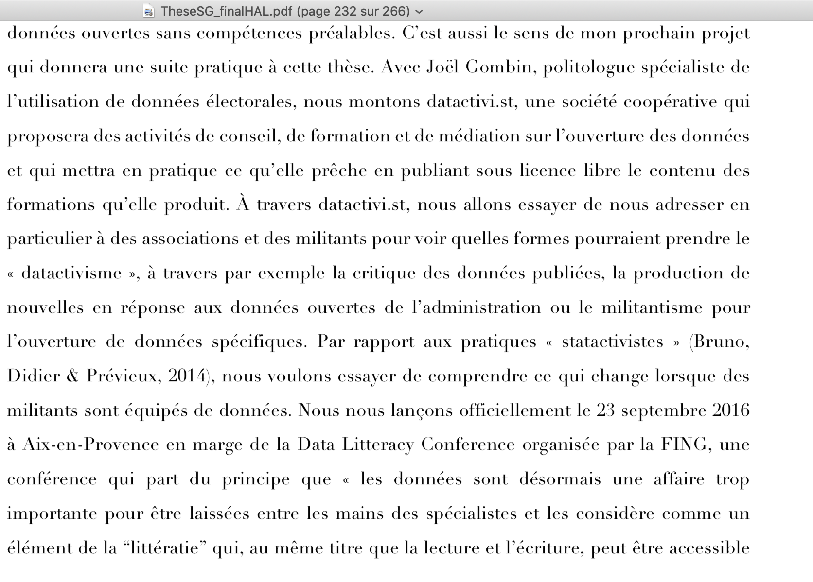]

.footnote[Extrait de la conclusion de la thèse de Samuel Goëta : https://datactivist.coop/these]

---
class: inverse, center, middle

# Souvenirs, souvenirs...

---
## Un parcours de recherche commencé en 2004

.center[
.reduite[
[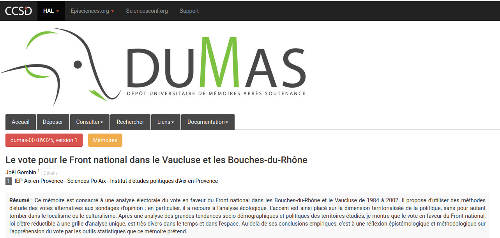](https://dumas.ccsd.cnrs.fr/dumas-00789325)
]
]

---
## Où il est question de CD-ROM

.center[.reduite[]]

---
## Quételet est devenu mon meilleur ami...

.center[.reduite[]]

---
## ...Avant d'être supplanté par data.gouv.fr

.center[.reduite[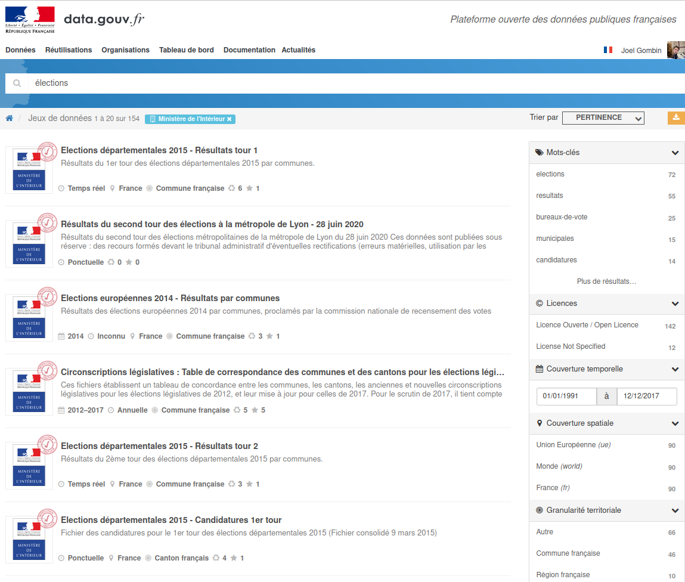]]

---
## La force d'une communauté

.center[
.reduite[
[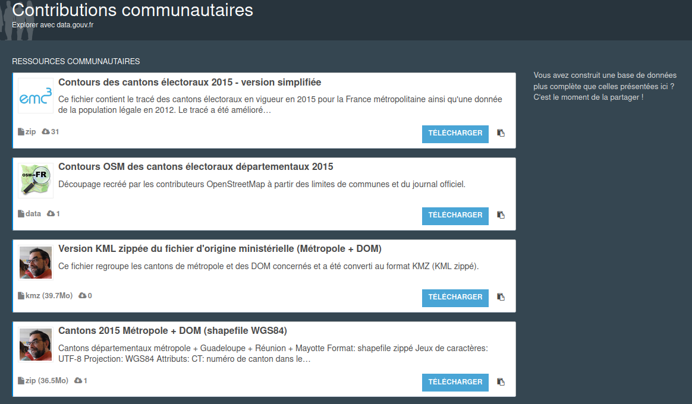](https://www.data.gouv.fr/fr/datasets/contours-des-cantons-electoraux-departementaux-2015/)
]
]

---
## Des économies substantielles de temps

.center[.reduite[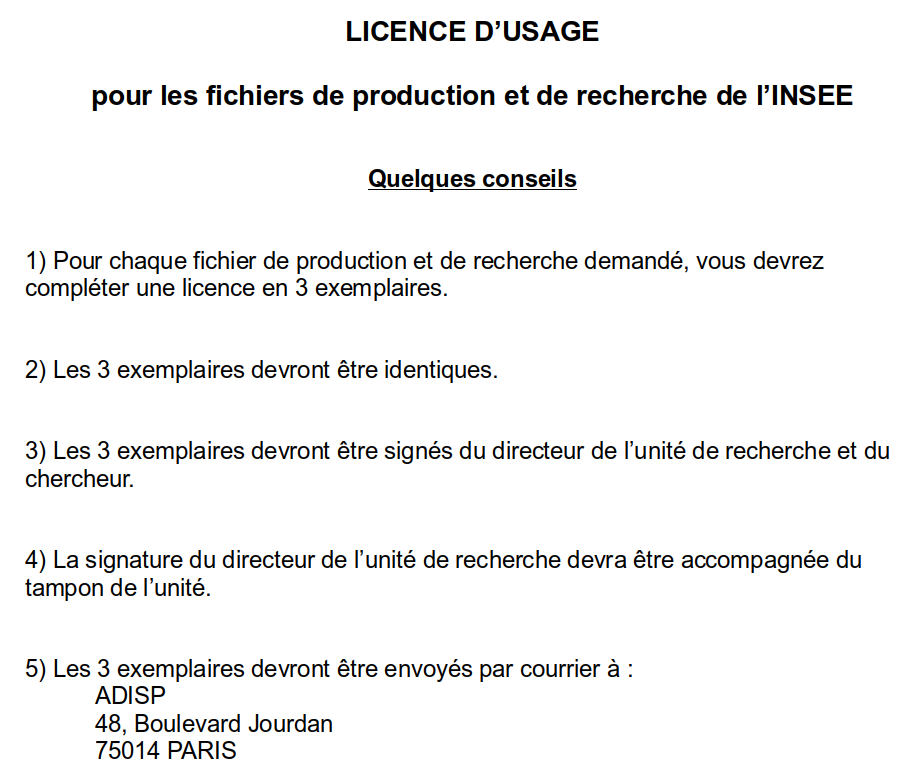]]

---
## Des économies substantielles de temps

.center[
.reduite[
[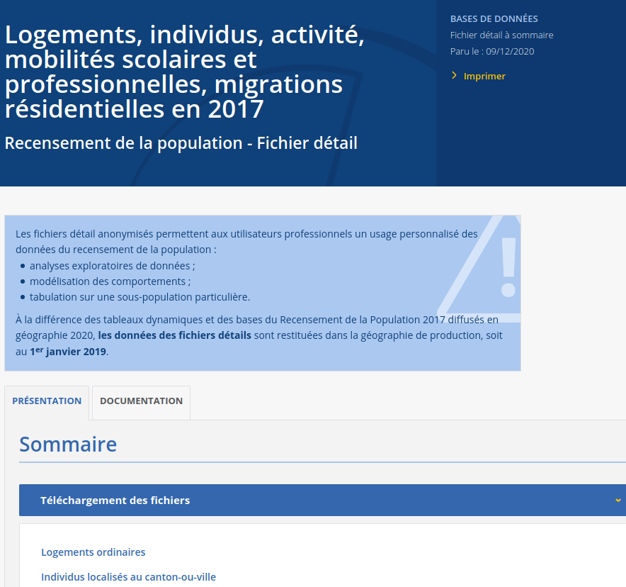](https://www.insee.fr/fr/statistiques/4508161)
]
]

---
## Des économies substantielles d'argent

.center[.reduite[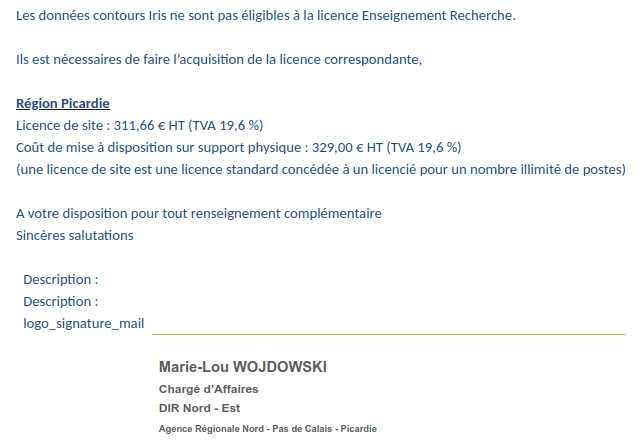]]

---
## Des économies substantielles d'argent

.center[
.reduite[
[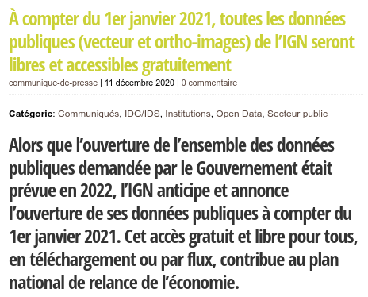](https://decryptageo.fr/ign-open-data-2021/)
]
]


---
## Des potentiels scientifiques nouveaux

[.center[.reduite[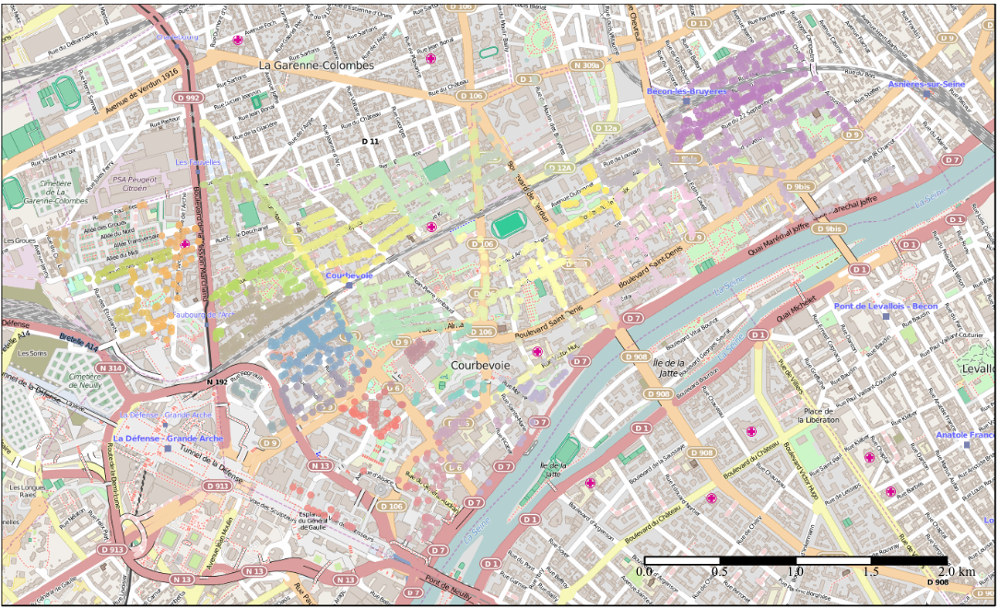]]](https://halshs.archives-ouvertes.fr/halshs-01588887)

---
## Des potentiels scientifiques nouveaux

[.center[.reduite[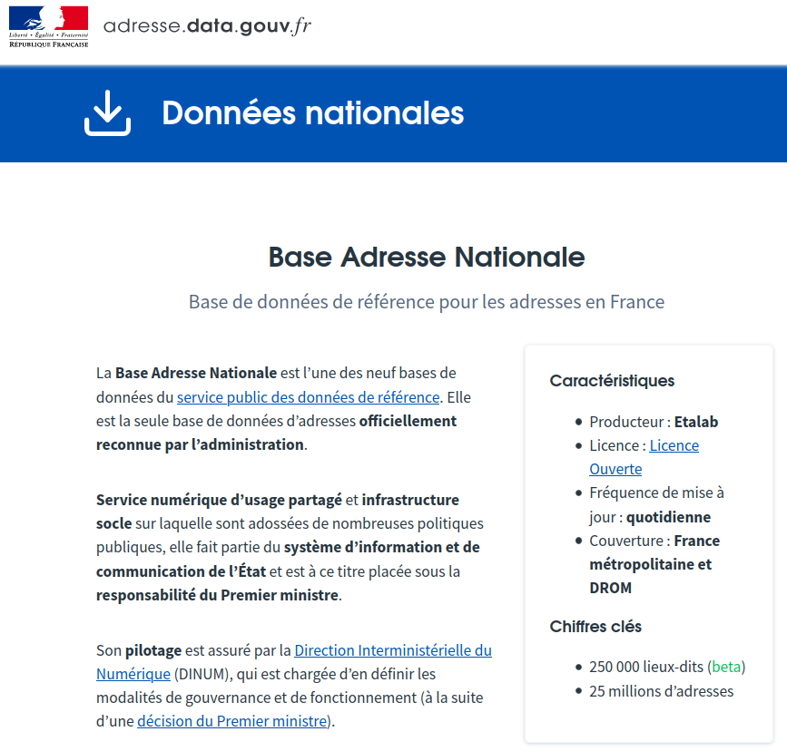]]](https://adresse.data.gouv.fr/donnees-nationales)

---
## Des potentiels scientifiques nouveaux

[.center[.reduite[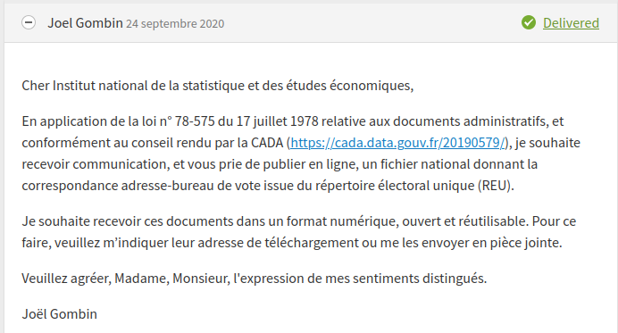]]](https://madada.fr/demande/extraction_de_la_correspondance)

---
## Open data... et open source

[.center[.reduite[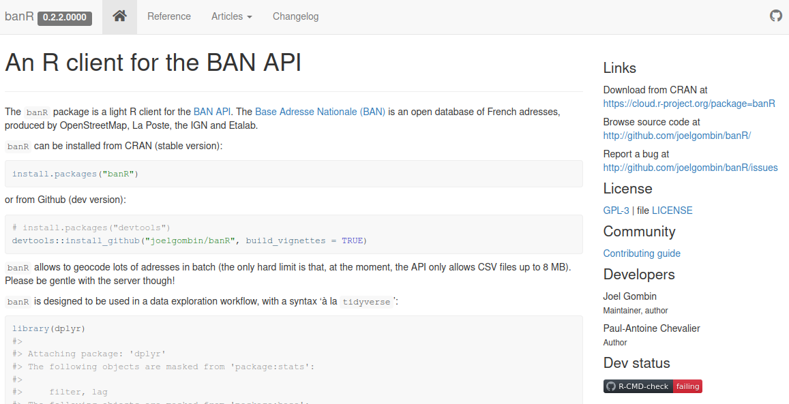]]](http://joelgombin.github.io/banR/)

---
## Donner sans reprendre

.pull-left[
[](https://github.com/datactivist/stickers)
]

.pull-right[
[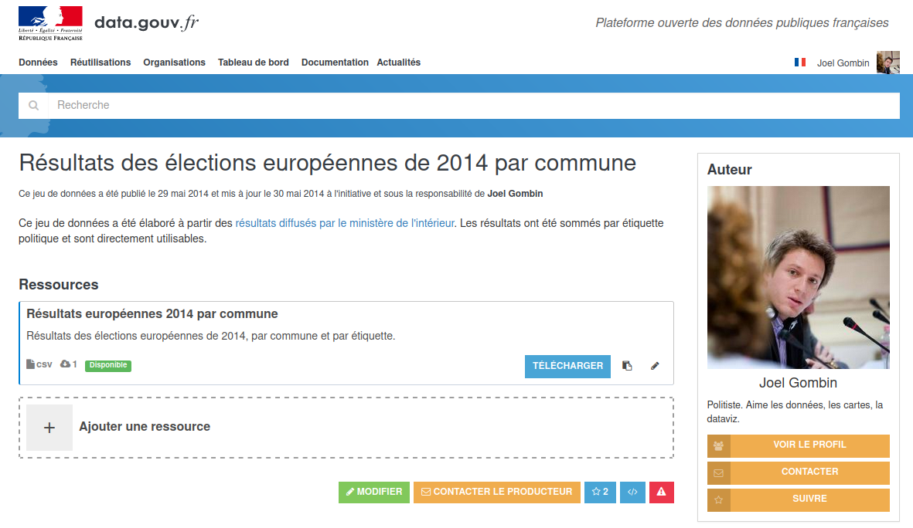](https://www.data.gouv.fr/fr/datasets/resultats-des-elections-europeennes-de-2014-par-commune/)
]

---
## Vers une économie circulaire des données de la recherche ?

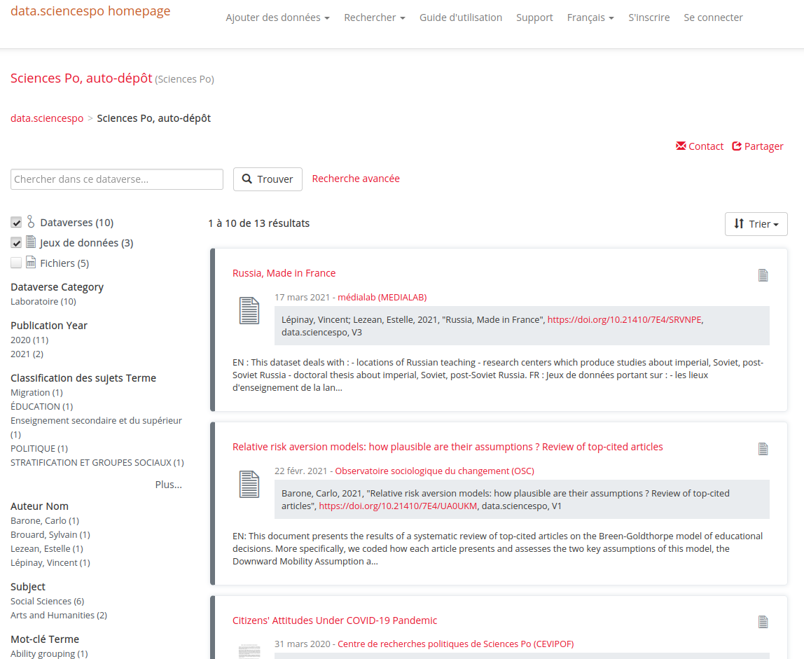

---
## Vers une économie circulaire des données de la recherche ?

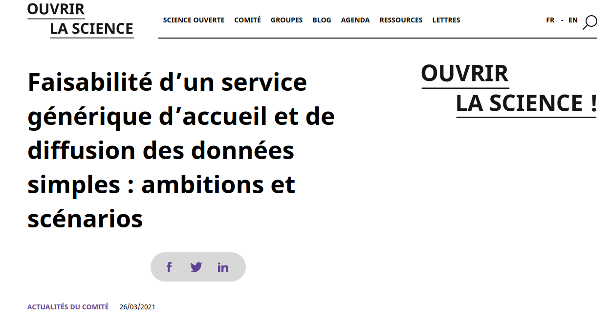


---
class: inverse, center, middle

# Des choses pas roses

---
### Une loi qui peine à être appliquée

Selon l'observatoire open data des territoires, seulement 10% des collectivités concernées par la loi pour une République numérique ont ouvert au moins un jeu de données.  
.reduite[
]

.footnote[[Source](http://www.observatoire-opendata.fr/resultats/)]

---
### Le long chemin de l'ouverture d'un jeu de données

.pull-left[
.reduite[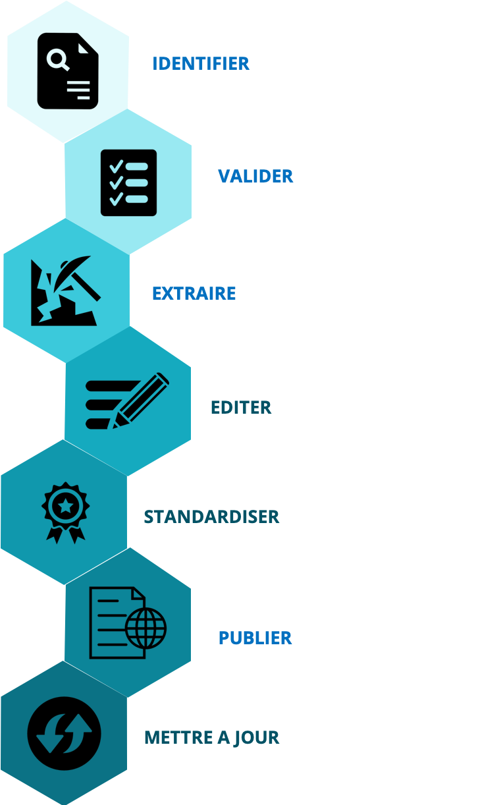]
]

.pull-right[
.middle[* Un travail invisible 

* Un travail rarement pris en compte dans les missions des agents

* Opérer une "inversion" de l'infrastructure (Bowker, 1994 ; Star, 1999)]
]

---
class: inverse, center, middle

# 4 défis de la réutilisation des données ouvertes

---

### .red[Défi 1 :] la découvrabilité des données

.center[**Découvrabilité** : capacité d'un contenu à sortir du lot]

--

.center[ou plutôt la **trouvabilité** : capacité pour un usager de tomber sur le bon contenu]

--
.pull-left[
> **La découverte des données est une condition préalable pour que les données ouvertes atteignent leur potentiel et la plupart des données sont actuellement difficiles à trouver.**
]

.pull-right[
.center[] 
]


.footnote[https://index.okfn.org/insights/]


---
### Un exemple de problème de .red[découvrabilité]


---
### Un exemple de données .red[introuvables]
Ce jeu de données contient plus de 6000 marchés publics attribués par l'Etat. Mais, malgré mon [signalement](https://www.data.gouv.fr/fr/datasets/aife-de-44785462100045/#discussion-5c5d2857634f41019657c80d-0), tout est fait pour le rendre introuvable !

[.reduite[]](https://www.data.gouv.fr/fr/datasets/aife-de-44785462100045/)

---
### Autre exemple de problèmes de .red[découvrabilité]

Sur data.gouv.fr, une requête "coronavirus" ne renvoie vers aucun jeu de données publié par Santé Publique France. Il faut rechercher "covid" pour les trouver, du nom de la maladie causée par le SARS COV-2. 

.center[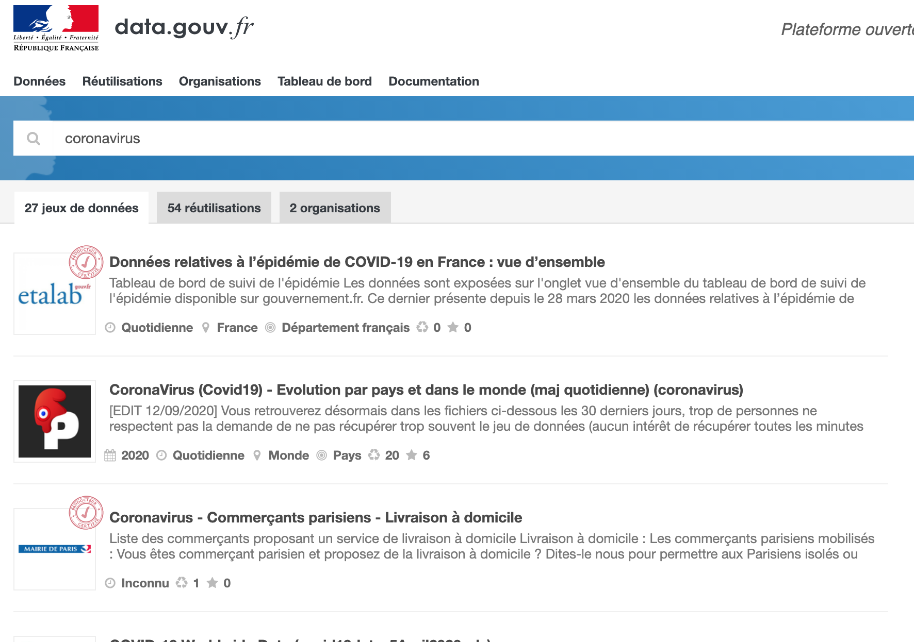]

---
### Autre exemple de problèmes de .red[découvrabilité]

Ce fichier contient tous les signes officiels de la qualité et de l'origine (SIQO) : les AOC et AOP, IGP, Label rouge, spécialité traditionnelle garantie, Agriculture biologique… Très utile mais qui peut le trouver sur data.gouv.fr ?
[](https://www.data.gouv.fr/fr/datasets/siqo-publies/)


---
### .red[Défi 2 :] la documentation des données

.pull-left[
Beaucoup de données sont accompagnées d’une description très réduite. 

Sans ces informations, il est très difficile pour un usager de comprendre ce que contient le jeu de données, ses conditions de production des données et ses limites.]

.pull-right[

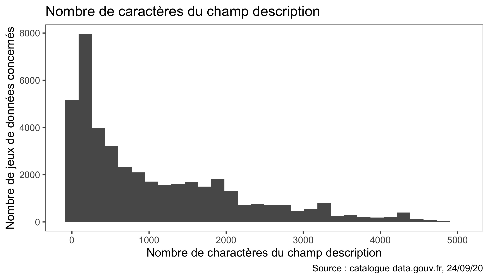

Sur data.gouv.fr, **22% des jeux de données** ont une description de moins de 180 caractères (un sms)


**59% ont moins de 1000** caractères (une demi-page)

]

---
### Un exemple de problème de .red[documentation]

Ce jeu de données sur les élections présidentielles de 2002, très réutilisé, comporte un champ description plus court que le titre du jeu de ddonnées.
.center[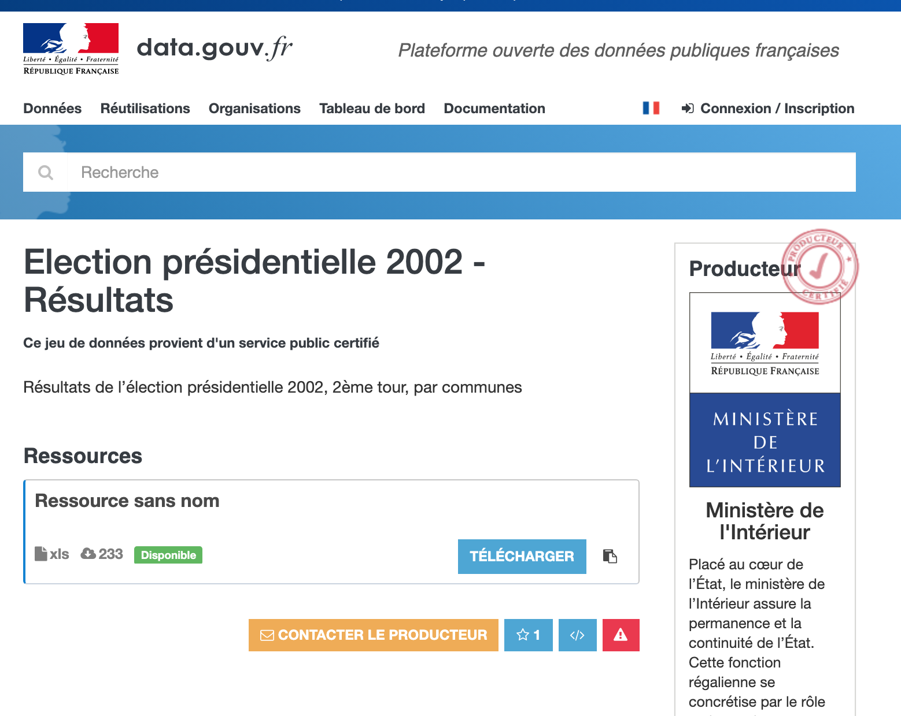]

---
### Un autre exemple de problème de .red[documentation]

Ici, la documentation est très succinte et ne fait que reprendre le libellés des colonnes. Or, qu'est ce qu'un musée de France ? comment les données sont collectées ? quand vont-elles être mises à jour ?
.center[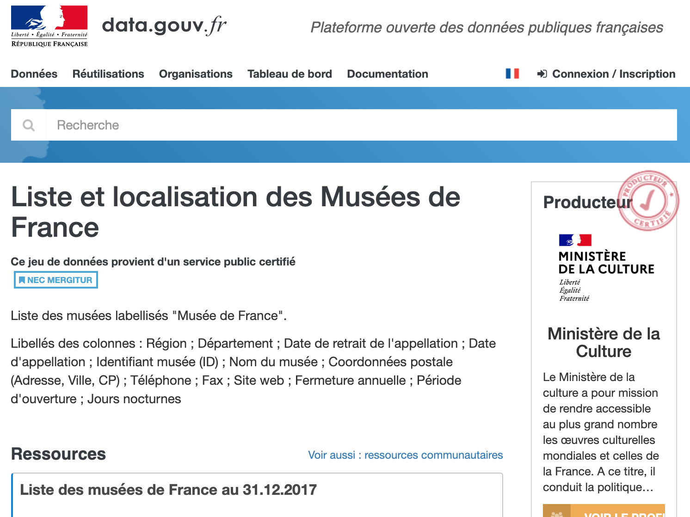]

---
### Un autre exemple de problème de .red[documentation]

Pour ces données, la description est relativement longue **mais…** elle ne fait que reprendre les termes de la licence, après un premier paragraphe très peu informatif. 
.center[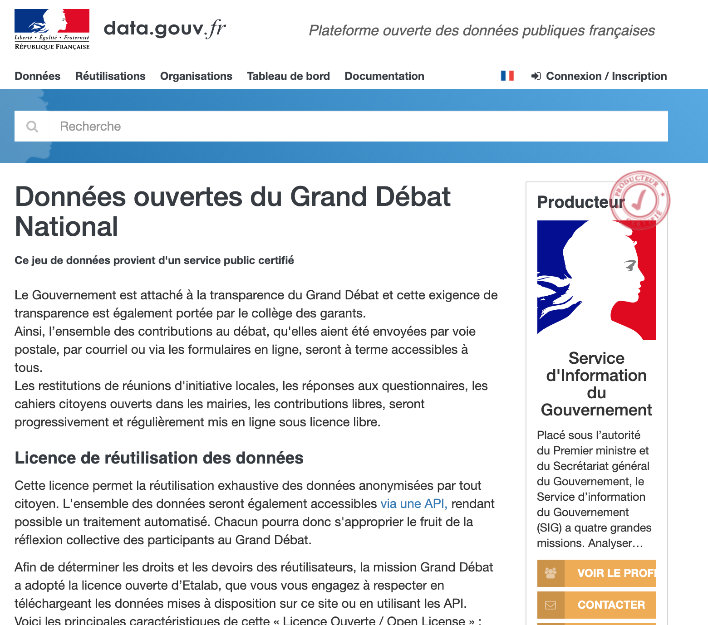]

---
### .red[Datasheet for Datasets] : une approche alternative pour la documentation des données

.pull-left[

[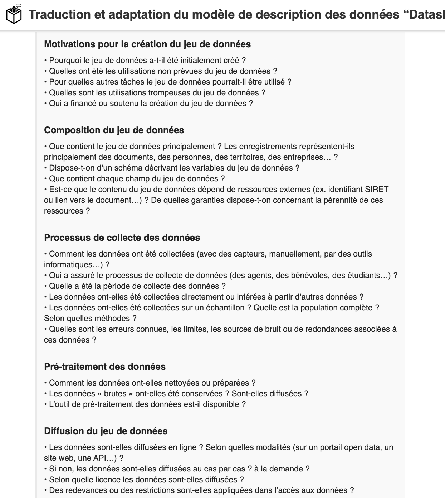](https://teamopendata.org/t/traduction-et-adaptation-du-modele-de-description-des-donnees-datasheet-for-datasets/1400)

]

.pull-right[
* Motivations pour la création du jeu de données

* Composition du jeu de données

* Processus de collecte des données

* Pré-traitement des données

* Diffusion du jeu de données

* Maintenance du jeu de données

* Considérations légales et éthiques


]
---
### .red[Défi 3 :] la qualité des données

Enfin, le troisième défi porte sur la **qualité** des données. 

Le rapport de [l’Open Data Barometer](https://opendatabarometer.org/4thedition/report/) signale  que :
> “les données des gouvernements sont souvent incomplètes, pas actualisées, de mauvaise qualité et fragmentaires”
et 

> “de manière générale, la gestion et la publication des données ouvertes sont fragiles et sujettes à des erreurs multiples.” 

⚠ la qualité des données ne dépend que de l’usage qui en est fait. 

La documentation est indispensable pour que le public parvienne à saisir les usages précédents des données et les adapte à de nouveaux usages, souvent inconnus de celles et ceux qui les produisent. 

---
### La qualité : une notion à prendre avec des précautions 

Garfinkel et Bittner (1967), deux sociologues confrontés à des difficultés d'exploitation de dossiers médicaux, ont été tentés de dénoncer la « mauvaise qualité » du remplissage de ces dossiers. 
 
Mais ils ont montré que les dossiers médicaux ont « **de bonnes raisons organisationnelles** » d’être « mal » remplis. 

Le personnel de l’hôpital collecte des informations pour ses propres missions dans un contexte organisationnel orienté vers un certain type d’actions, le soin des patients, et non la recherche en sciences sociales. 

Les dossiers médicaux comme les données sont des **écrits organisationnellement situés**. Ce sont des données métiers, **produites généralement à des fins de gestion**, qui deviennent un objet de savoir et de pouvoir.

---
### La circulation des données provoque des frictions


> A chaque interface entre deux surfaces, **la friction consomme de l’énergie, produit de la chaleur et use les parties en mouvement**. La métaphore d’Edwards des frictions de données décrit ce qui survient à l’interface entre les « surfaces » de données : les points où les données bougent entre les personnes, les couches sociales, les organisations ou les machines […] Chaque mouvement de données à travers une interface a un coût en temps, énergie et attention humaine. Chaque interface entre groupes et organisations, ainsi qu’entre les machines, représente un point de résistance où les données peuvent être rendues incompréhensibles, mal interprétées ou perdues. Dans les systèmes sociaux, les frictions de données **consomment de l’énergie et produisent des turbulences et de la chaleur**.

.footnote[Edwards, Paul N., et al. “[Science Friction: Data, Metadata, and Collaboration](www.jstor.org/stable/41301955).” Social Studies of Science, vol. 41, no. 5, 2011]


---
### Un exemple de données inutilisables


---
### Un autre exemple de données inutilisables


---
### .red[Défi 4 :] les échanges entre producteurs et réutilisateurs

Pour répondre aux problèmes identifiés par les usagers liés à la découvrabilité, la documentation ou la qualité, on pourrait, plutôt que de les résoudre immédiatement, s'appuyer sur les commentaires et les retours des usagers pour identifier les priorités. 

Mais en pratique, la plupart des agents en charge de l'ouverture n'ont pas de temps dédié à traiter ces commentaires et à les résoudre. 

Résultat : les échanges se font rares et les usagers n'ont souvent pas de réponse. Sur data.gouv.fr, **40,5% des discussions** n'ont qu'un seul message, la question initiale. Les producteurs ne répondent pas systématiquement.


---

class: inverse, center, middle

# Merci !

Contact : [joel@datactivist.coop](mailto:joel@datactivist.coop)
